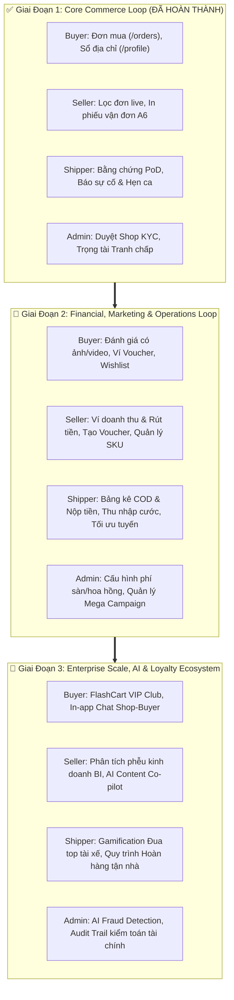

# 🗺️ Lộ Trình Phát Triển Toàn Diện: Giai Đoạn 2 & Giai Đoạn 3 (FlashCart Platform Roadmap)

> **Tài liệu đặc tả kỹ thuật & phân rã chức năng (Technical Specification & Implementation Guide)**  
> **Dự án**: Nền tảng Thương Mại Điện Tử FlashCart (TerraSweep Client)  
> **Kiến trúc giao diện**: Next.js App Router • Tailwind CSS • Ocean Aesthetic • Impeccable UX  
> **Trạng thái**: Giai đoạn P1 đã hoàn thành (`commit: 94798e2`). Tài liệu này quy định chi tiết phân kỳ **Giai đoạn 2 (P2)** và **Giai đoạn 3 (P3)** cho cả 4 vai trò (**Buyer, Seller, Shipper, Admin**).

---

## 🧭 Tổng Quan Kiến Trúc & Vòng Lặp Giá Trị (Value Loops)



---

# 🚀 GIAI ĐOẠN 2 (P2): TÀI CHÍNH, MARKETING & TỐI ƯU VẬN HÀNH
*(Financial, Marketing & Operations Loop)*

### Mục Tiêu Chiến Lược:
- Kích hoạt vòng lặp giữ chân khách hàng (Customer Retention) bằng đánh giá thực tế và mã giảm giá.
- Minh bạch hóa dòng tiền cho Người bán (Seller Payout) và Đối soát tiền mặt cho Shipper (COD Reconciliation).
- Cung cấp cho Admin công cụ điều phối chiến dịch quảng bá và thu phí nền tảng.

---

## 1. 🛍️ Phân Hệ Buyer (Người Mua Hàng)

### 1.1. Trung Tâm Đánh Giá & Chấm Điểm Sản Phẩm (Review & Ratings System)
- **Vị trí**: Modal trên trang `/orders` khi đơn hàng ở trạng thái `delivered` (Giao thành công) hoặc trang riêng `/orders/[id]/review`.
- **Nghiệp vụ chi tiết**:
  - Đánh giá 5 sao tổng thể và tiêu chí con (Chất lượng sản phẩm, Độ đúng mô tả, Tốc độ giao hàng).
  - Tải lên tối đa 5 hình ảnh chụp thực tế hoặc video mở hộp (Unboxing).
  - Thẻ nhận xét nhanh dạng chips: *"Chất lượng tuyệt vời"*, *"Giao hàng siêu tốc"*, *"Đóng gói cẩn thận"*, *"Đúng mô tả"*.
  - Tích hợp tặng thưởng **Xu FlashCoin (+200 Xu)** ngay sau khi hoàn thành đánh giá hợp lệ.
  - Đồng bộ điểm đánh giá và lượt review vào trang Chi tiết sản phẩm (`app/[productId]/page.tsx`).
- **Dữ liệu & Types**:
  ```typescript
  export interface ProductReview {
    id: string;
    orderId: string;
    productId: string;
    userId: string;
    userName: string;
    userAvatar: string;
    rating: number; // 1 to 5
    comment: string;
    photos: string[];
    createdAt: string;
    helpfulCount: number;
    sellerReply?: string;
  }
  ```

### 1.2. Ví Voucher & Kho Mã Khuyến Mãi (Voucher Wallet / Coupon Center)
- **Vị trí**: Trang `/vouchers` và Drawer chọn voucher tại trang Giỏ hàng `/cart`.
- **Nghiệp vụ chi tiết**:
  - Phân loại 3 nhóm voucher chính:
    1. *Voucher Miễn Phí Vận Chuyển (Freeship Xtra)*: Giảm 15.000₫ - 40.000₫ phí ship.
    2. *Voucher Giảm Giá Sàn / FlashCart Global*: Giảm 10% - 25% tối đa 100.000₫.
    3. *Voucher Riêng Gian Hàng (Merchant Voucher)*: Áp dụng cho từng Shop cụ thể.
  - Chức năng lưu voucher từ chiến dịch (Nút *"Lưu mã"* chuyển sang *"Đã lưu"*).
  - Thanh nhập mã voucher độc quyền / Influencer code kèm thông báo lỗi cụ thể nếu không hợp lệ hoặc hết lượt.
  - Đồng bộ tự động gợi ý mã tốt nhất (Best Deal Suggestion) khi thanh toán tại `/cart`.

### 1.3. Danh Sách Yêu Thích & Cảnh Báo Giảm Giá (Wishlist & Price Alerts)
- **Vị trí**: Trang `/wishlist` và biểu tượng trái tim góc phải `BuyerHeader`.
- **Nghiệp vụ chi tiết**:
  - Hiển thị danh sách sản phẩm đã lưu, phân theo tình trạng còn hàng / hết hàng.
  - Huy hiệu cảnh báo giảm giá: *"Giảm 15% so với lúc bạn lưu"*.
  - Nút thêm nhanh vào giỏ hàng ngay từ Wishlist.

---

## 2. 🏪 Phân Hệ Seller (Chủ Gian Hàng)

### 2.1. Ví Tiền Gian Hàng & Quyết Toán Doanh Thu (Seller Wallet & Payouts)
- **Vị trí**: Tab mới *"Ví Tiền & Doanh Thu"* trong `components/seller/SellerDashboard.tsx`.
- **Nghiệp vụ chi tiết**:
  - 3 Thẻ số dư tài chính:
    1. *Số dư khả dụng (Available Balance)*: Tiền từ các đơn đã giao thành công vượt quá thời hạn khiếu nại (3 ngày).
    2. *Số dư đang đóng băng (Pending Clearance)*: Tiền từ đơn hàng đang giao hoặc trong thời gian đối soát.
    3. *Tổng tiền đã rút về ngân hàng (Total Withdrawn)*.
  - Lịch sử biến động số dư (Transaction Ledger): Doanh thu đơn hàng, Chiết khấu sàn, Phí hoàn hàng.
  - Chức năng **Yêu Cầu Rút Tiền (Withdrawal Request)**:
    - Nhập số tiền muốn rút về tài khoản ngân hàng đã KYC.
    - Thời gian giải ngân mô phỏng: 24h làm việc.
- **Dữ liệu & Types**:
  ```typescript
  export interface WalletTransaction {
    id: string;
    type: 'order_income' | 'platform_fee' | 'withdrawal' | 'dispute_refund';
    amount: number;
    orderId?: string;
    description: string;
    createdAt: string;
    status: 'completed' | 'pending' | 'failed';
  }
  ```

### 2.2. Trung Tâm Marketing Của Shop (Shop Marketing Hub)
- **Vị trí**: Tab *"Khuyến Mãi & Voucher"* trong Seller Dashboard.
- **Nghiệp vụ chi tiết**:
  - Tạo Voucher riêng của Shop:
    - Đặt tên mã (e.g. `AERO10K`), mức giảm (% hoặc số tiền), giá trị đơn tối thiểu.
    - Cài đặt thời hạn hiệu lực và giới hạn số lượt sử dụng.
  - Đăng ký sản phẩm tham gia các đợt **Flash Sale Giờ Vàng** của sàn FlashCart.
  - Thiết lập Combo khuyến mãi (Mua kèm Deal sốc, Mua 2 giảm 5%).

### 2.3. Quản Lý Biến Thể Sản Phẩm Nâng Cao (Multi-Variant SKU Matrix)
- **Vị trí**: Nâng cấp Modal *"Thêm sản phẩm mới"* trong Seller Dashboard.
- **Nghiệp vụ chi tiết**:
  - Thiết lập ma trận 2 thuộc tính: [Size: 39, 40, 41, 42] x [Màu sắc: Obsidian Black, Neon Blue, Chalk White].
  - Nhập giá bán và số lượng tồn kho riêng cho từng SKU cụ thể.
  - Cảnh báo tồn kho an toàn (Low stock alert khi tồn < 5).

---

## 3. 🚚 Phân Hệ Shipper (Tài Xế Vận Chuyển)

### 3.1. Bảng Kê Thu Hộ Tiền Mặt & Nộp Quỹ COD (COD Cash Reconciliation)
- **Vị trí**: Tab *"Ví Thu Nhập & Đối Soát COD"* trong `components/shipper/ShipperDashboard.tsx`.
- **Nghiệp vụ chi tiết**:
  - Bảng kê tổng tiền mặt COD đã thu trong ngày từ các đơn giao thành công.
  - Cảnh báo hạn mức giữ tiền mặt tối đa (ví dụ: Tối đa 5.000.000₫ phải nộp về Hub).
  - Chức năng **Nộp Quỹ COD Bưu Cục**:
    - Hiển thị mã QR VietQR động với đúng số tiền cần chuyển nộp.
    - Nút *"Xác nhận đã nộp tiền mặt tại Hub bưu cục"*.
- **Dữ liệu & Types**:
  ```typescript
  export interface ShipperSettlement {
    id: string;
    shipperId: string;
    collectedCodAmount: number;
    shippingEarnings: number; // Thu nhập cước công giao
    settledStatus: 'unsettled' | 'settled';
    lastSettledAt?: string;
  }
  ```

### 3.2. Bảng Kê Thu Nhập Giao Hàng (Earnings & Delivery Fee Summary)
- **Nghiệp vụ chi tiết**:
  - Thống kê tiền công mỗi đơn: 18.000₫/kiện thường, 25.000₫/kiện hỏa tốc.
  - Tiền thưởng hoàn thành mốc ngày: Giao > 15 đơn thưởng 50.000₫, > 25 đơn thưởng 100.000₫.
  - Biểu đồ thu nhập 7 ngày gần nhất của tài xế.

### 3.3. Tối Ưu Tuyến Đường Giao Hàng (Smart Route Sorting)
- **Nghiệp vụ chi tiết**:
  - Sắp xếp các điểm giao hàng trên cùng một phường/quận lại gần nhau.
  - Nút *"Tối ưu thứ tự giao hàng"* tự động đẩy các đơn gần vị trí shipper lên trước.

---

## 4. 🛡️ Phân Hệ Admin (Quản Trị Viên Hệ Thống)

### 4.1. Cấu Hình Phí Sàn & Thuế Giao Dịch (Commission & Fee Settings)
- **Vị trí**: Tab *"Cấu Hình Phí Nền Tảng"* trong `components/admin/AdminDashboard.tsx`.
- **Nghiệp vụ chi tiết**:
  - Cài đặt tỷ lệ phí sàn theo từng ngành hàng:
    - Thời trang & Giày dép: 4.5% / đơn.
    - Đồ điện tử & Cyber Audio: 2.5% / đơn.
    - Gia dụng: 3.5% / đơn.
  - Cài đặt phí cố định xử lý thanh toán (Payment Gateway Fee: 1.5%).
  - Bảng tính doanh thu thuần mà sàn thu được từ phí hoa hồng.

### 4.2. Quản Trị Chiến Dịch & Banner Marketing (Campaign CMS)
- **Vị trí**: Tab *"Chiến Dịch & Banner Sàn"*.
- **Nghiệp vụ chi tiết**:
  - Thêm, sửa, xóa Banner trang chủ kèm đường link chuyển hướng danh mục.
  - Thiết lập Mega Sale ngày đôi (ví dụ: `FLASH-SALE-9.9` hoặc `SUMMER-OCEAN`).
  - Hẹn giờ tự động bật / tắt chiến dịch khuyến mãi toàn sàn.

### 4.3. Kiểm Duyệt Danh Mục Sản Phẩm Mới (Product Moderation)
- **Nghiệp vụ chi tiết**:
  - Hàng đợi các sản phẩm mới được người bán tạo, chờ duyệt trước khi hiển thị công khai trên Storefront.
  - Duyệt hoặc từ chối sản phẩm nếu vi phạm từ khóa hoặc ảnh không phù hợp.

---

# 💎 GIAI ĐOẠN 3 (P3): NÂNG CAO, AI & HỆ SINH THÁI LOYALTY
*(Enterprise Scale, AI, Loyalty & Advanced Logistics)*

### Mục Tiêu Chiến Lược:
- Nâng tầm FlashCart thành siêu ứng dụng thương mại điện tử chuẩn quốc tế.
- Khai thác sức mạnh AI hỗ trợ người bán viết nội dung và hệ thống gợi ý cá nhân hóa.
- Hoàn thiện hệ sinh thái Loyalty đa cấp bậc và nhắn tin tương tác thời gian thực.

---

## 1. 🛍️ Phân Hệ Buyer (Người Mua Hàng)

### 1.1. Hệ Sinh Thái Khách Hàng Thân Thiết (FlashCart VIP / Loyalty Club)
- **Vị trí**: Trang `/loyalty` hoặc phân hệ tích hợp trong `/profile`.
- **Nghiệp vụ chi tiết**:
  - 4 Hạng hội viên:
    1. *Đồng (Bronze)*: Mặc định khi đăng ký.
    2. *Bạc (Silver)*: Chi tiêu > 2.000.000₫/năm.
    3. *Vàng (Gold)*: Chi tiêu > 8.000.000₫/năm (Tặng 5 voucher Freeship/tháng).
    4. *Kim Cương (Diamond)*: Chi tiêu > 25.000.000₫/năm (Ưu tiên xử lý đơn, hỗ trợ 24/7 riêng, quà sinh nhật).
  - Tích lũy và tiêu điểm **FlashCoin**:
    - Tỷ lệ: 1.000₫ chi tiêu = 1 Xu.
    - Đổi xu lấy voucher độc quyền hoặc giảm trực tiếp vào giỏ hàng (`1 Xu = 1₫`).

### 1.2. Nhắn Tin Thời Gian Thực Người Mua - Người Bán (Live In-App Chat)
- **Vị trí**: Widget Chat ghim góc dưới màn hình hoặc Drawer chat.
- **Nghiệp vụ chi tiết**:
  - Khách hàng bấm *"Chat với Shop"* từ trang chi tiết sản phẩm hoặc trang đơn hàng.
  - Tự động đính kèm thẻ sản phẩm hoặc mã đơn hàng đang thắc mắc vào khung chat.
  - Phản hồi tự động (Auto-responder) khi Shop offline: *"Cảm ơn bạn! Shop sẽ phản hồi trong vòng 15 phút"*.

---

## 2. 🏪 Phân Hệ Seller (Chủ Gian Hàng)

### 2.1. Phân Tích Kinh Doanh & Phễu Chuyển Đổi (Deep Analytics & BI)
- **Vị trí**: Tab *"Phân Tích Kinh Doanh Chuyên Sâu"* trong Seller Dashboard.
- **Nghiệp vụ chi tiết**:
  - Biểu đồ phễu chuyển đổi (Conversion Funnel):
    - Lượt truy cập shop (Visits) ➔ Xem sản phẩm (Product Views) ➔ Thêm vào giỏ (Add to Cart) ➔ Đặt hàng thành công (Paid Orders).
  - Thống kê tỷ lệ hoàn hàng / giao thất bại theo từng nhóm sản phẩm.
  - Dự báo nhu cầu tồn kho (Inventory Forecast) dựa trên tốc độ bán trung bình 30 ngày.

### 2.2. AI Trợ Lý Nhà Bán (AI Seller Co-Pilot)
- **Nghiệp vụ chi tiết**:
  - Nút *"Viết mô tả bằng AI"* trong form tạo sản phẩm:
    - Tự động tạo mô tả sản phẩm hấp dẫn, chuẩn SEO, gạch đầu dòng tính năng nổi bật chỉ từ tên sản phẩm và ảnh chụp.
  - Gợi ý mức giá bán tối ưu (Dynamic Pricing recommendation) so với các đối thủ cùng ngành hàng.

---

## 3. 🚚 Phân Hệ Shipper (Tài Xế Vận Chuyển)

### 3.1. Bảng Xếp Hạng & Gamification Tài Xế (Driver Leaderboard & Badges)
- **Nghiệp vụ chi tiết**:
  - Hệ thống cấp bậc tài xế: *Tập Sự ➔ Chuyên Nghiệp ➔ Hạm Đội Trưởng (Fleet Pro Master)*.
  - Bảng xếp hạng Top 10 tài xế có tỷ lệ giao thành công cao nhất tuần.
  - Huy hiệu thành tích: *"Giao 100 đơn 5 sao"*, *"Chiến thần giao nhanh dưới 30 phút"*.

### 3.2. Quy Trình Thu Hồi Đơn Trả Hàng (Reverse Logistics & Return Pickup)
- **Nghiệp vụ chi tiết**:
  - Khi Admin duyệt khiếu nại hoàn tiền, đơn hàng phát sinh nhiệm vụ: *"Thu hồi hàng hoàn từ khách"*.
  - Shipper nhận thông báo đến tận nhà khách lấy kiện hàng lỗi.
  - Kiểm tra tình trạng kiện hàng, chụp ảnh niêm phong và vận chuyển ngược về kho của Shop.

---

## 4. 🛡️ Phân Hệ Admin (Quản Trị Viên Hệ Thống)

### 4.1. Hệ Thống Phát Hiện Gian Lận & Rủi Ro (Fraud Detection Engine)
- **Vị trí**: Tab *"An Ninh & Phòng Chống Gian Lận"* trong Admin Dashboard.
- **Nghiệp vụ chi tiết**:
  - Phát hiện các hành vi bất thường:
    - Cùng 1 thiết bị/IP tạo nhiều tài khoản mua hàng để gom mã giảm giá.
    - Shop tự tạo đơn ảo để đánh giá ảo (Brushing scam).
  - Tự động gắn cờ đỏ cảnh báo (Risk Flag) và cho phép Admin khóa tài khoản nghi vấn chỉ bằng 1 click.

### 4.2. Nhật Ký Kiểm Toán Toàn Hệ Thống (Enterprise Audit Trail & Compliance)
- **Nghiệp vụ chi tiết**:
  - Ghi nhận lịch sử bất biến (Immutable Audit Log) của mọi hành động can thiệp dữ liệu:
    - Ai đã duyệt hồ sơ shop nào?
    - Ai đã phán quyết hoàn tiền cho tranh chấp nào?
    - Thời gian, IP và chi tiết lệnh can thiệp.
  - Xuất báo cáo tài chính đối soát định dạng Excel / PDF phục vụ báo cáo cổ đông và kiểm toán thuế.

---

## 📅 Ma Trận Ưu Tiên & Trình Tự Triển Khai Đề Xuất (Execution Roadmap)

| Hạng mục | Mức độ ưu tiên | Độ phức tạp | Ước tính thời gian | Phụ thuộc (Prerequisites) |
| :--- | :---: | :---: | :---: | :--- |
| **P2.1**: Đánh giá sản phẩm & Chấm sao | 🔴 P0 (Rất cao) | Trung bình | 1 Sprint | Đã có P1 Orders |
| **P2.2**: Kho Voucher & Mã giảm giá | 🔴 P0 (Rất cao) | Trung bình | 1 Sprint | Đã có CartContext |
| **P2.3**: Ví Seller & Yêu cầu rút tiền | 🟡 P1 (Cao) | Trung bình | 1 Sprint | Đã có SellerDashboard |
| **P2.4**: Đối soát quỹ COD cho Shipper | 🟡 P1 (Cao) | Thấp | 0.5 Sprint | Đã có ShipperDashboard |
| **P2.5**: Cấu hình phí sàn & Campaign CMS | 🟡 P1 (Cao) | Trung bình | 1 Sprint | Đã có AdminDashboard |
| **P3.1**: FlashCart VIP Club & FlashCoin | 🟢 P2 (Trung bình) | Trung bình | 1 Sprint | Hoàn thành P2 |
| **P3.2**: In-App Chat thời gian thực | 🟢 P2 (Trung bình) | Khá cao | 1.5 Sprint | Hoàn thành P2 |
| **P3.3**: BI Analytics & Phễu chuyển đổi | 🟢 P2 (Trung bình) | Trung bình | 1 Sprint | Hoàn thành P2 |
| **P3.4**: AI Seller Co-Pilot & Fraud Engine | ⚪ P3 (Nâng cao) | Cao | 2 Sprints | Hoàn thành P2 & P3.1 |

---

## 📌 Hướng Dẫn Kích Hoạt Khi Bắt Đầu Triển Khai
Khi bạn sẵn sàng triển khai Giai đoạn 2 hoặc Giai đoạn 3, bạn chỉ cần gửi yêu cầu kèm mã hạng mục:
- *Ví dụ*: `tiến hành triển khai P2.1 và P2.2` hoặc `bắt đầu toàn bộ giai đoạn P2`.
- Hệ thống sẽ đọc trực tiếp từ tài liệu [`ROADMAP_P2_P3.md`](file:///d:/flashcart-client/ROADMAP_P2_P3.md) này để lập Implementation Plan chi tiết trước khi sinh mã nguồn.
